# SJ Dashboard Framework - Architecture Documentation

> **Version**: 2.0  
> **Last Updated**: January 2026  
> **Status**: Production Ready

This document provides a comprehensive visual overview of the SJ Dashboard Framework architecture, including all components, data flows, and system relationships evolved from the original V1 design.

---

## Table of Contents

1. [High-Level Architecture](#1-high-level-architecture)
2. [Framework Layers](#2-framework-layers)
3. [Authentication & Authorization Flow](#3-authentication--authorization-flow)
4. [Route Protection System](#4-route-protection-system)
5. [Data Flow Architecture](#5-data-flow-architecture)
6. [Component Hierarchy](#6-component-hierarchy)
7. [State Management Pattern](#7-state-management-pattern)
8. [Feature Module Structure](#8-feature-module-structure)
9. [AI Framework Architecture](#9-ai-framework-architecture)
10. [Integration Hub Architecture](#10-integration-hub-architecture)
11. [Edge Functions Architecture](#11-edge-functions-architecture)
12. [Storage Architecture](#12-storage-architecture)
13. [Directory Structure](#13-directory-structure)
14. [Database Schema](#14-database-schema)
15. [Development Workflow](#15-development-workflow)
16. [Deployment Architecture](#16-deployment-architecture)
17. [Scalability Considerations](#17-scalability-considerations)
18. [Theming System](#18-theming-system)
19. [Framework Tiers](#19-framework-tiers)
20. [Key Design Patterns](#20-key-design-patterns)
21. [Summary & References](#21-summary--references)

---

## 1. High-Level Architecture

The framework consists of four main layers working together to provide a complete business dashboard solution with AI capabilities and multi-provider integrations.

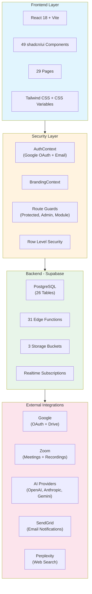

### Key Statistics (V2)

| Component | V1 Count | V2 Count | Change |
|-----------|----------|----------|--------|
| Pages | 15 | 29 | +14 |
| Hooks | 10 | 24 | +14 |
| Edge Functions | 4 | 31 | +27 |
| Database Tables | 12 | 26 | +14 |
| UI Components | 30 | 49 | +19 |
| Storage Buckets | 0 | 3 | +3 |

---

## 2. Framework Layers

The framework is built in four distinct layers, each with specific responsibilities and dependencies.

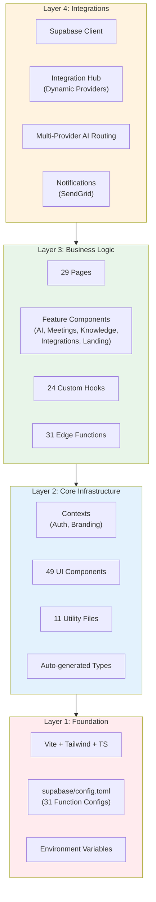

### Layer Details

| Layer | Purpose | Key Files |
|-------|---------|-----------|
| Foundation | Build config, type safety | `vite.config.ts`, `tailwind.config.ts`, `supabase/config.toml` |
| Core Infrastructure | Reusable building blocks | `AuthContext.tsx`, `BrandingContext.tsx`, `src/components/ui/*` |
| Business Logic | Feature implementation | `src/pages/*`, `src/hooks/*`, `supabase/functions/*` |
| Integrations | External service connections | `supabase/functions/*`, Integration Hub system |

---

## 3. Authentication & Authorization Flow

The framework supports multiple authentication methods with automatic profile creation.

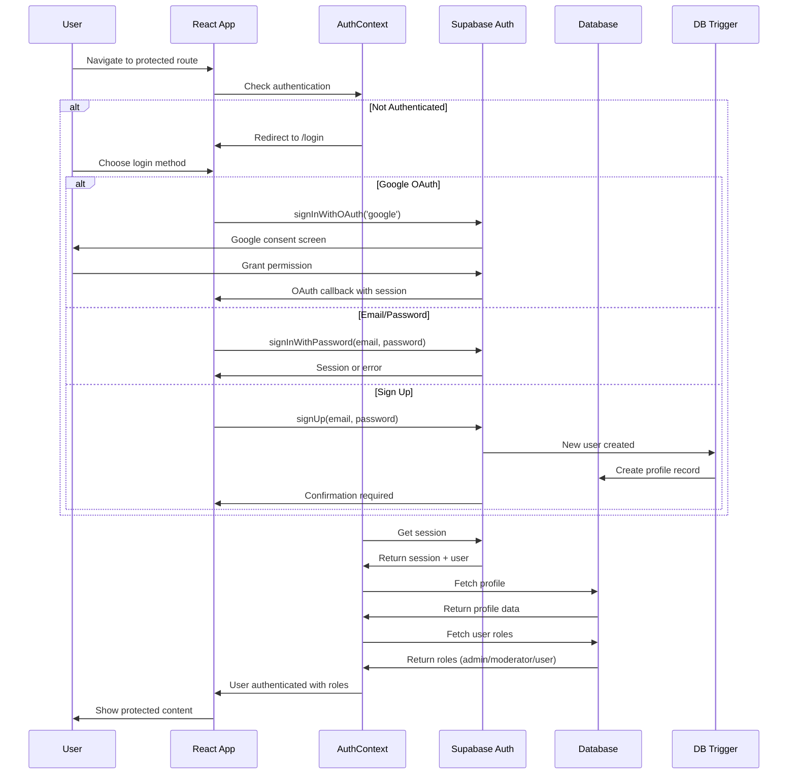

### Role-Based Access Control

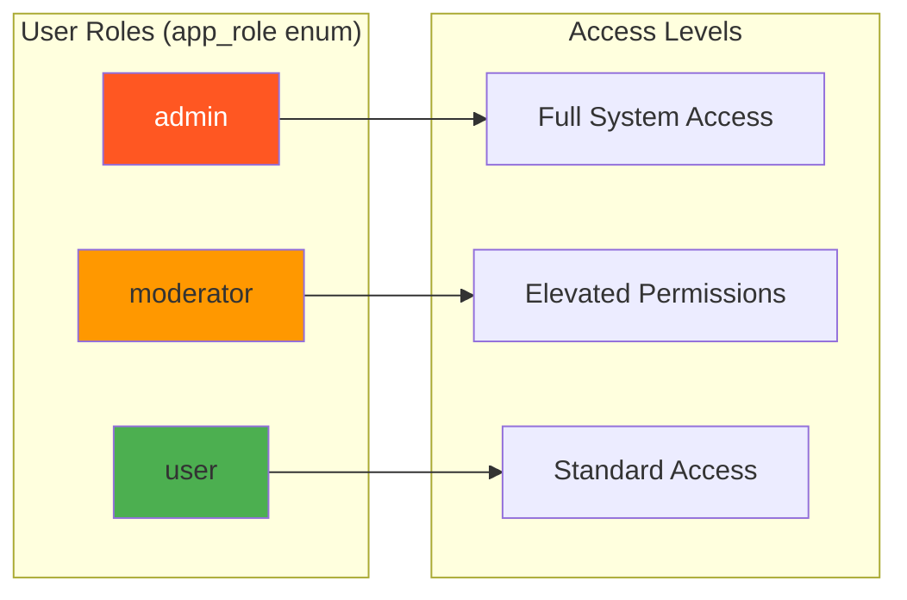

---

## 4. Route Protection System

The framework uses a layered route protection system with feature flags for module access control.

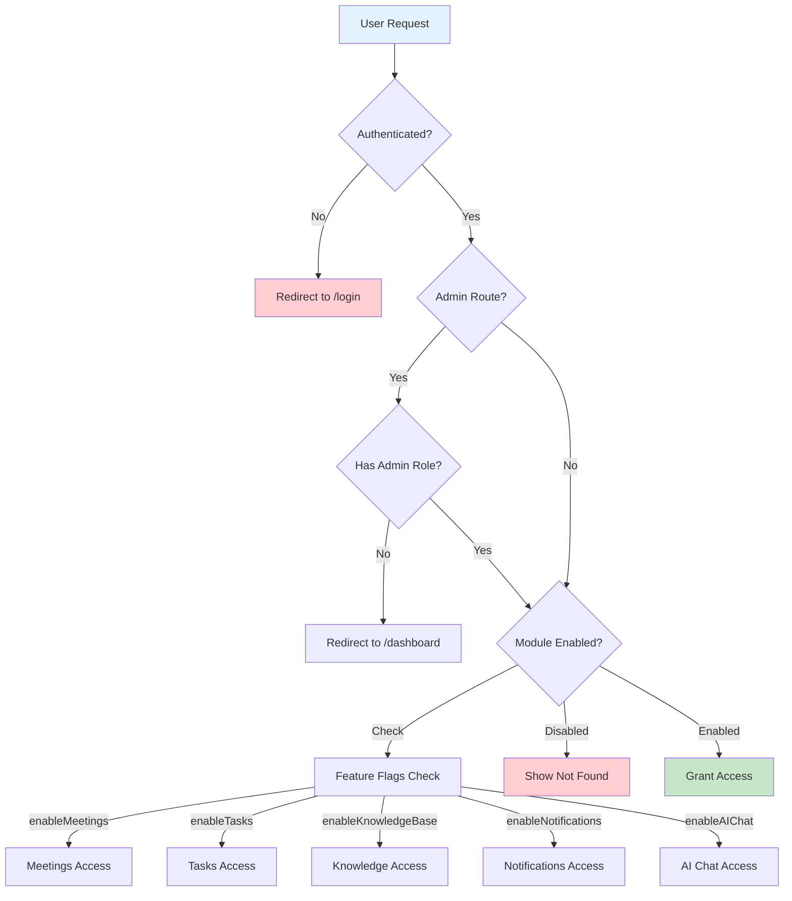

### Route Components

| Component | Purpose | Location |
|-----------|---------|----------|
| `ProtectedRoute` | Requires authentication | `src/components/auth/ProtectedRoute.tsx` |
| `AdminRoute` | Requires admin role | `src/components/auth/AdminRoute.tsx` |
| `ModuleRoute` | Checks feature flags | `src/components/routing/ModuleRoute.tsx` |

### Feature Flags Configuration

```typescript
// Feature flags in app_config table
{
  enableMeetings: boolean,
  enableTasks: boolean,
  enableKnowledgeBase: boolean,
  enableNotifications: boolean,
  enableAIChat: boolean,
  enableClients: boolean
}
```

---

## 5. Data Flow Architecture

Data flows through multiple layers with caching, type safety, and security at each level.

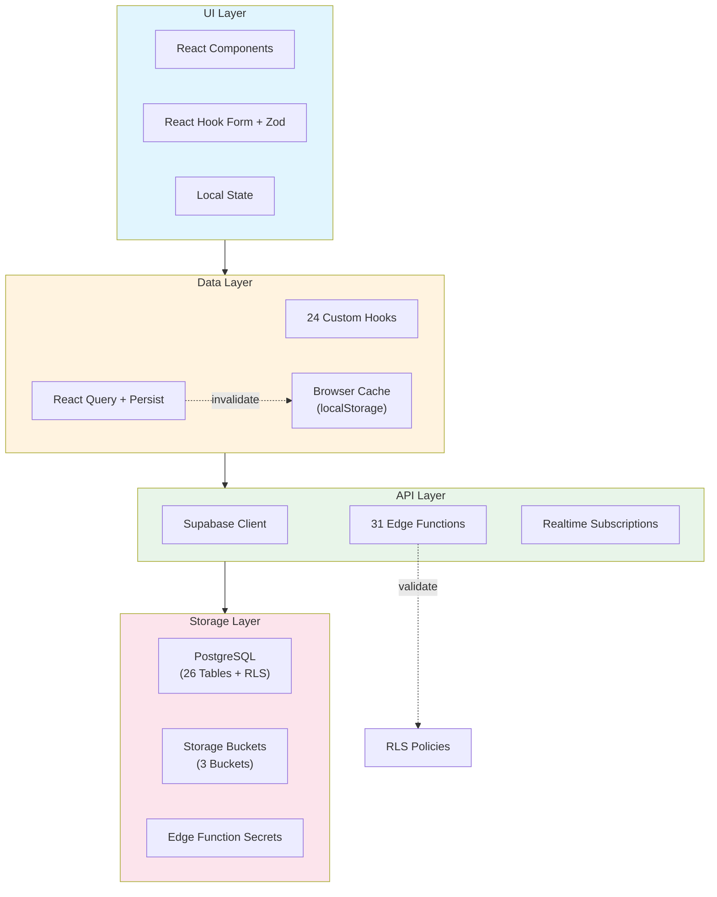

### React Query Configuration

```typescript
// Query client with persistence
const queryClient = new QueryClient({
  defaultOptions: {
    queries: {
      staleTime: 1000 * 60 * 5, // 5 minutes
      gcTime: 1000 * 60 * 30,   // 30 minutes
      retry: 1,
      refetchOnWindowFocus: false,
    },
  },
});

// Persist to localStorage
const persister = createSyncStoragePersister({
  storage: window.localStorage,
});
```

---

## 6. Component Hierarchy

The component structure follows a clear hierarchy from layout to feature components.

```mermaid
graph TB
    subgraph Root["Application Root"]
        App["App.tsx"]
    end
    
    subgraph Providers["Context Providers"]
        QP["QueryClientProvider"]
        Auth2["AuthProvider"]
        Brand["BrandingProvider"]
        Theme["ThemeProvider"]
        Tooltip2["TooltipProvider"]
    end
    
    subgraph Layouts["Layout Components"]
        DL["DashboardLayout"]
        AL["AdminLayout"]
        Sidebar["AppSidebar / AdminSidebar"]
        TopNav["TopNav"]
    end
    
    subgraph Pages2["Page Components (29)"]
        Public["Public: Index, Login, Signup"]
        Dashboard2["Dashboard, Profile, Settings"]
        Business["Clients, Meetings, Tasks, Knowledge"]
        AI2["AIChat, AIAgents"]
        Admin2["Admin Panel (10 pages)"]
    end
    
    subgraph Features["Feature Components"]
        AIComp["ai/: ChatInterface, SemanticSearch, AgentModal"]
        IntComp["integrations/: ProviderCard, DynamicForm, UsageChart"]
        MeetComp["meetings/: Summary, Transcript, ZoomFiles"]
        KnowComp["knowledge/: RelatedArticles"]
        LandComp["landing/: Hero, Features, Pricing, Footer"]
        UserKnow["user-knowledge/: GoogleDrivePicker"]
    end
    
    subgraph Common["Common Components"]
        EmptyState["EmptyState"]
        Loading["LoadingSpinner"]
    end
    
    subgraph UILib["UI Library (49 components)"]
        Shadcn["shadcn/ui components"]
    end
    
    App --> Providers
    Providers --> Layouts
    Layouts --> Pages2
    Pages2 --> Features
    Features --> Common
    Common --> UILib
    
    style Root fill:#ffebee
    style Providers fill:#e3f2fd
    style Layouts fill:#e8f5e9
    style Pages2 fill:#fff3e0
    style Features fill:#f3e5f5
    style UILib fill:#e0f2f1
```

### Component Categories

| Category | Count | Location |
|----------|-------|----------|
| UI Components | 49 | `src/components/ui/` |
| Layout Components | 4 | `src/components/layout/` |
| AI Components | 4 | `src/components/ai/` |
| Integration Components | 8 | `src/components/integrations/` |
| Landing Components | 8 | `src/components/landing/` |
| Meeting Components | 4 | `src/components/meetings/` |
| Auth Components | 2 | `src/components/auth/` |
| Common Components | 2 | `src/components/common/` |

---

## 7. State Management Pattern

The framework uses a combination of React Query for server state and React Context for client state.

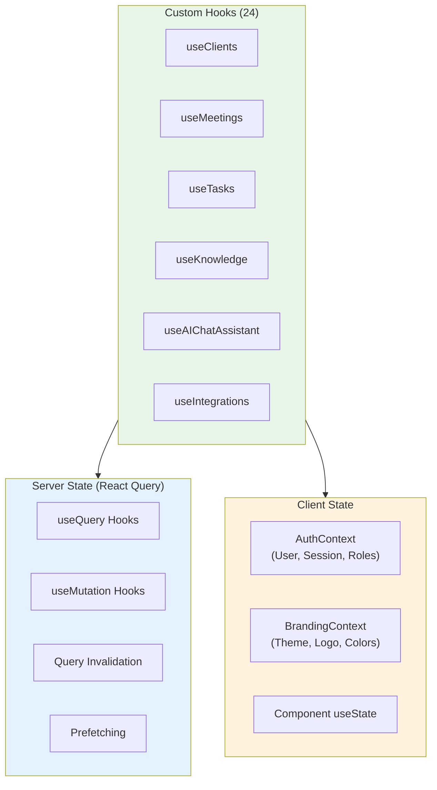

### Hook Categories

| Category | Hooks | Purpose |
|----------|-------|---------|
| Data Fetching | useClients, useMeetings, useTasks, useKnowledge | CRUD operations |
| AI/Search | useAIChatAssistant, useSemanticSearch, useAIAgents | AI features |
| Integrations | useIntegrations, useIntegrationStatus | Integration Hub |
| User | usePreferences, useOnboarding, useUserKnowledge | User settings |
| Admin | useKnowledgeAdmin, useRoles, useUserInvites | Admin functions |
| System | useAppConfig, useFeatureFlags, useNotifications | App configuration |

---

## 8. Feature Module Structure

Each feature module follows a consistent structure pattern.

### Example: Clients Module

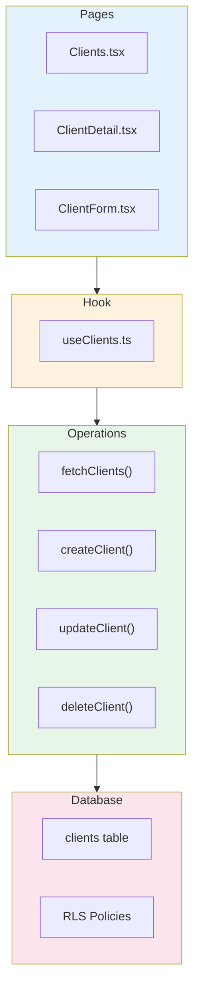

### Example: Integration Hub Module

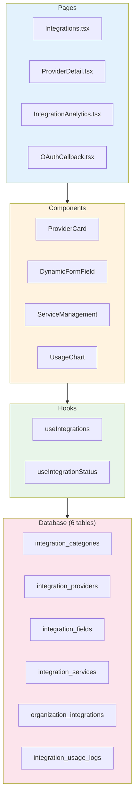

---

## 9. AI Framework Architecture

The AI system supports multiple providers with dynamic routing, embeddings, and agent personalization.

```mermaid
graph TB
    subgraph AIFrontend["Frontend"]
        AIChat2["AIChat.tsx"]
        AIAgents2["AIAgents.tsx"]
        ChatInterface["AIChatInterface"]
        SearchComp["SemanticSearch"]
        AgentModal["AgentPersonalizationModal"]
    end
    
    subgraph AIHooks["Hooks"]
        useChatAssist["useAIChatAssistant"]
        useSearch["useSemanticSearch"]
        useAgents["useAIAgents"]
        useModelSync2["useModelSync"]
    end
    
    subgraph AIEdge["Edge Functions (9)"]
        ChatFn["ai-chat-assistant"]
        SearchFn["semantic-search"]
        EmbedFn["generate-embeddings"]
        AgentFn["run-ai-agent"]
        SummaryFn["generate-meeting-summary"]
        UnifiedFn["unified-knowledge-search"]
        AutoEmbed1["auto-embed-knowledge-entry"]
        AutoEmbed2["auto-embed-knowledge-files"]
        AutoEmbed3["auto-embed-meetings"]
    end
    
    subgraph AIShared["Shared Utilities"]
        ProviderRoute["ai-provider-routing.ts"]
        AgentPers["agent-personalization.ts"]
        PerplexitySearch["perplexity-search.ts"]
    end
    
    subgraph AIProviders["AI Providers"]
        OpenAI["OpenAI<br/>(GPT-4, Embeddings)"]
        Anthropic["Anthropic<br/>(Claude)"]
        Gemini["Google Gemini"]
        Perplexity["Perplexity<br/>(Web Search)"]
    end
    
    subgraph AIDB["Database (7 tables)"]
        AIProvTable["ai_providers"]
        AIModels["ai_models"]
        AIAgentsTable["ai_agents"]
        AIChatHist["ai_chat_history"]
        AIRuns["ai_agent_runs"]
        AIUsage["ai_usage_logs"]
        Embeddings["embeddings"]
    end
    
    AIFrontend --> AIHooks
    AIHooks --> AIEdge
    AIEdge --> AIShared
    AIShared --> AIProviders
    AIEdge --> AIDB
    
    style AIFrontend fill:#e3f2fd
    style AIHooks fill:#fff3e0
    style AIEdge fill:#e8f5e9
    style AIProviders fill:#fce4ec
    style AIDB fill:#f3e5f5
```

### AI Provider Routing

```typescript
// Dynamic provider selection based on configuration
interface ProviderConfig {
  provider: 'openai' | 'anthropic' | 'gemini';
  model: string;
  temperature?: number;
  max_tokens?: number;
}

// Agents can specify preferred providers
interface AIAgent {
  provider_config: ProviderConfig;
  data_sources: string[]; // 'knowledge', 'meetings', 'clients', etc.
  memory_enabled: boolean;
}
```

### Embedding Flow

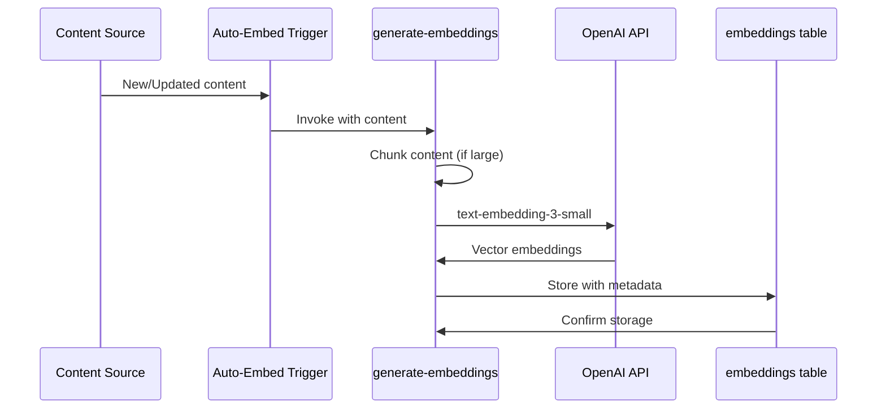

---

## 10. Integration Hub Architecture

The Integration Hub provides a dynamic, database-driven system for managing third-party integrations.

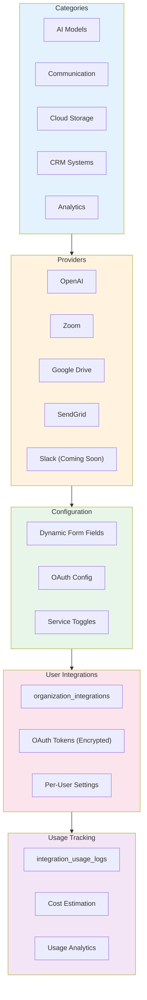

### Integration Provider Schema

```typescript
interface IntegrationProvider {
  id: string;
  category_id: string;
  name: string;
  slug: string;
  auth_type: 'api_key' | 'oauth2' | 'none';
  oauth_config?: {
    authorize_url: string;
    token_url: string;
    scopes: string[];
  };
  is_available: boolean;
  is_beta: boolean;
  is_coming_soon: boolean;
}

interface IntegrationField {
  provider_id: string;
  field_key: string;
  field_type: 'text' | 'password' | 'select' | 'checkbox';
  label: string;
  is_required: boolean;
  is_sensitive: boolean;
  validation_regex?: string;
}
```

### OAuth Flow

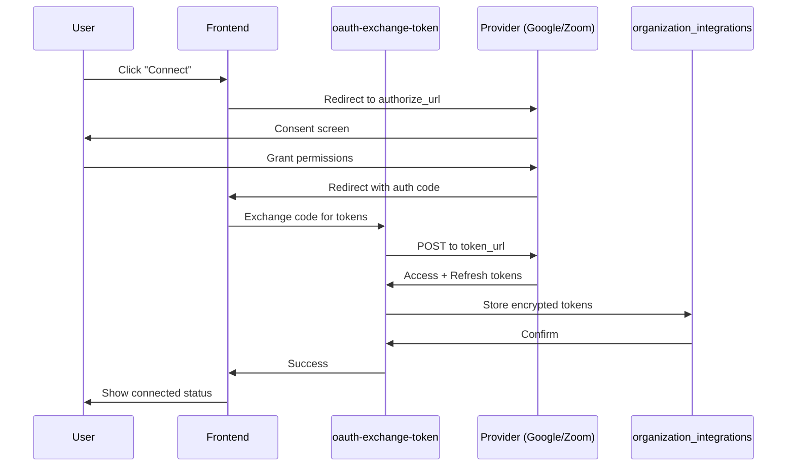

---

## 11. Edge Functions Architecture

The framework includes 31 edge functions organized by domain.

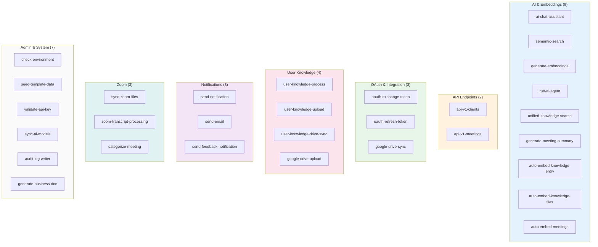

### JWT Verification Settings

| Category | verify_jwt | Reason |
|----------|------------|--------|
| AI/Embeddings | true | User context needed |
| API Endpoints | true | Authentication required |
| OAuth | true | Secure token exchange |
| Notifications | false | System/webhook triggered |
| Auto-embed | false | Trigger-based invocation |
| Admin | true | Admin access required |

### Shared Utilities

```
supabase/
├── cors.ts                 # CORS headers helper
├── auth-middleware.ts      # JWT validation
├── error-handler.ts        # Consistent error responses
├── audit-logger.ts         # Activity logging
├── ai-provider-routing.ts  # Multi-provider AI routing
├── agent-personalization.ts # Agent customization
├── google-drive.ts         # Google Drive API wrapper
├── perplexity-search.ts    # Perplexity API wrapper
├── sendgrid-email.ts       # Email sending
├── secure-encryption.ts    # Token encryption
└── api-middleware.ts       # API key validation
```

---

## 12. Storage Architecture

The framework uses three Supabase storage buckets for different content types.

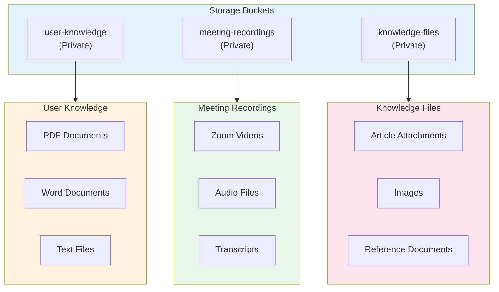

### Storage Policies

| Bucket | Public | Access Pattern |
|--------|--------|----------------|
| user-knowledge | No | User's own files only |
| meeting-recordings | No | Meeting organizer only |
| knowledge-files | No | Based on entry permissions |

---

## 13. Directory Structure

Complete project directory structure reflecting the V2 architecture.

```
sj-dashboard-framework/
├── Configuration (Root)
│   ├── vite.config.ts
│   ├── tailwind.config.ts
│   ├── tsconfig.json
│   ├── eslint.config.js
│   ├── index.html
│   └── .env.example
│
├── public/
│   ├── robots.txt
│   └── placeholder.svg
│
├── src/
│   ├── Entry Points
│   │   ├── main.tsx              # App bootstrap
│   │   ├── App.tsx               # Router + Providers
│   │   ├── App.css               # Global styles
│   │   └── index.css             # Tailwind + CSS vars
│   │
│   ├── contexts/
│   │   ├── AuthContext.tsx       # Auth state + methods
│   │   └── BrandingContext.tsx   # Theme configuration
│   │
│   ├── components/
│   │   ├── ui/ (49 files)        # shadcn/ui components
│   │   ├── ai/                   # AI feature components
│   │   │   ├── AIChatInterface.tsx
│   │   │   ├── SemanticSearch.tsx
│   │   │   ├── AgentPersonalizationModal.tsx
│   │   │   └── index.ts
│   │   ├── auth/                 # Auth guards
│   │   │   ├── ProtectedRoute.tsx
│   │   │   └── AdminRoute.tsx
│   │   ├── common/               # Shared components
│   │   │   ├── EmptyState.tsx
│   │   │   ├── LoadingSpinner.tsx
│   │   │   └── index.ts
│   │   ├── integrations/         # Integration Hub
│   │   │   ├── ProviderCard.tsx
│   │   │   ├── DynamicFormField.tsx
│   │   │   ├── ServiceManagement.tsx
│   │   │   ├── UsageChart.tsx
│   │   │   └── ...
│   │   ├── knowledge/            # Knowledge features
│   │   │   └── RelatedArticles.tsx
│   │   ├── landing/              # Landing page
│   │   │   ├── HeroSection.tsx
│   │   │   ├── FeatureGrid.tsx
│   │   │   ├── PricingPreview.tsx
│   │   │   └── ...
│   │   ├── layout/               # Layout components
│   │   │   ├── DashboardLayout.tsx
│   │   │   ├── AdminLayout.tsx
│   │   │   ├── AppSidebar.tsx
│   │   │   ├── AdminSidebar.tsx
│   │   │   └── TopNav.tsx
│   │   ├── meetings/             # Meeting features
│   │   │   ├── MeetingSummary.tsx
│   │   │   ├── TranscriptViewer.tsx
│   │   │   ├── ZoomFileList.tsx
│   │   │   └── index.ts
│   │   ├── routing/              # Route utilities
│   │   │   ├── ModuleRoute.tsx
│   │   │   └── index.ts
│   │   └── user-knowledge/       # User knowledge
│   │       ├── GoogleDriveFilePicker.tsx
│   │       └── index.ts
│   │
│   ├── pages/ (29 pages)
│   │   ├── Public
│   │   │   ├── Index.tsx         # Landing page
│   │   │   ├── Login.tsx
│   │   │   ├── Signup.tsx
│   │   │   └── NotFound.tsx
│   │   ├── Dashboard
│   │   │   ├── Dashboard.tsx
│   │   │   ├── Profile.tsx
│   │   │   ├── Settings.tsx
│   │   │   └── Notifications.tsx
│   │   ├── Business
│   │   │   ├── Clients.tsx, ClientDetail.tsx, ClientForm.tsx
│   │   │   ├── Meetings.tsx, MeetingDetail.tsx, MeetingForm.tsx
│   │   │   ├── Tasks.tsx, TaskDetail.tsx, TaskForm.tsx
│   │   │   └── Knowledge.tsx, KnowledgeDetail.tsx, KnowledgeForm.tsx
│   │   ├── AI
│   │   │   ├── AIChat.tsx
│   │   │   └── AIAgents.tsx
│   │   ├── User Knowledge
│   │   │   └── PersonalKnowledge.tsx
│   │   └── admin/ (10 pages)
│   │       ├── Integrations.tsx
│   │       ├── ProviderDetail.tsx
│   │       ├── AIModelManagement.tsx
│   │       ├── AIUsageAnalytics.tsx
│   │       ├── UserManagement.tsx
│   │       ├── RoleManagement.tsx
│   │       ├── SystemSettings.tsx
│   │       ├── ActivityLogs.tsx
│   │       └── ...
│   │
│   ├── hooks/ (24 hooks)
│   │   ├── Data: useClients, useMeetings, useTasks, useKnowledge
│   │   ├── AI: useAIChatAssistant, useSemanticSearch, useAIAgents
│   │   ├── Integration: useIntegrations, useIntegrationStatus
│   │   ├── User: usePreferences, useOnboarding, useUserKnowledge
│   │   └── System: useAppConfig, useFeatureFlags, useNotifications
│   │
│   ├── lib/ (11 utilities)
│   │   ├── utils.ts              # General utilities
│   │   ├── supabase.ts           # Client helper
│   │   ├── validation.ts         # Zod schemas
│   │   ├── sanitize.ts           # XSS prevention
│   │   ├── cache.ts              # Cache utilities
│   │   ├── export-utils.ts       # PDF/CSV export
│   │   ├── integration-utils.ts  # Integration helpers
│   │   ├── oauth-token-manager.ts
│   │   ├── activity-logger.ts
│   │   ├── webhook-handlers.ts
│   │   └── zoom-sync.ts
│   │
│   └── integrations/supabase/
│       ├── client.ts             # Supabase client
│       └── types.ts              # Auto-generated types
│
├── supabase/
│   ├── config.toml               # 31 function configs
│   ├── migrations/               # Database migrations
│   │
│   ├── Shared Utilities
│   │   ├── cors.ts
│   │   ├── auth-middleware.ts
│   │   ├── error-handler.ts
│   │   ├── audit-logger.ts
│   │   ├── ai-provider-routing.ts
│   │   ├── agent-personalization.ts
│   │   ├── google-drive.ts
│   │   ├── perplexity-search.ts
│   │   ├── sendgrid-email.ts
│   │   ├── secure-encryption.ts
│   │   └── api-middleware.ts
│   │
│   └── functions/ (31 edge functions)
│       ├── _shared/
│       │   └── ai-provider-routing.ts
│       ├── ai-chat-assistant/
│       ├── semantic-search/
│       ├── generate-embeddings/
│       └── ... (28 more)
│
└── docs/
    ├── README.md
    ├── ARCHITECTURE.md (this file)
    ├── QUICKSTART.md
    ├── DEPLOYMENT.md
    ├── ADMIN-GUIDE.md
    ├── SECRETS_MANAGEMENT.md
    ├── INTEGRATION_USER_GUIDE.md
    ├── INTEGRATION_API_REFERENCE.md
    └── integrations/providers/
        ├── zoom.md
        └── microsoft-teams.md
```

---

## 14. Database Schema

The database consists of **94+ tables and 6 views** organized across 20 functional modules. For the complete schema reference with all columns, types, and relationships, see **[database-schema.md](./database-schema.md)**.

### Module Summary

| Module | Tables | Key Tables |
|--------|--------|------------|
| Core / Auth | 7 | `profiles`, `user_roles`, `app_modules`, `app_config` |
| Activity & Notifications | 3 | `activity_logs`, `notifications`, `feedback` |
| AI Agents & Chat | 11 | `ai_agents`, `ai_models`, `ai_providers`, `agent_conversations` |
| Agent Execution & Memory | 6 | `agent_execution_plans`, `agent_memories`, `user_preferences` |
| MCP Tool Orchestration | 3 | `mcp_servers`, `mcp_tools`, `mcp_tool_executions` |
| Embeddings & RAG | 7 | `embeddings`, `embedding_queue`, `gemini_corpora` |
| Knowledge Base | 6 | `knowledge_entries`, `knowledge_files`, `knowledge_categories` |
| Meetings | 14 | `meetings`, `meeting_participants`, `meeting_files`, `zoom_files` |
| Clients & CRM | 4 | `clients`, `contacts`, `client_meetings` |
| Contact Intelligence | 8 | `contact_activities`, `contact_ai_summaries`, `lead_intent_analysis` |
| Deals / Business Dev | 3 | `deals`, `deal_activities`, `deal_comments` |
| Projects | 13 | `projects`, `project_milestones`, `project_billing` |
| Tasks / Actions | 7 | `tasks`, `task_streams`, `task_comments`, `task_attachments` |
| EOS / OKRs | 12 | `eos_vto`, `eos_issues`, `okrs`, `accountability_charts` |
| Productivity & HR | 11 | `departments`, `employee_profiles`, `pods`, `productivity_records` |
| Integrations | 8 | `integration_providers`, `organization_integrations`, `user_oauth_tokens` |
| Email & Communications | 4 | `email_logs`, `email_tracking_events`, `sendgrid_config` |
| Microsoft Graph | 4 | `graph_webhook_subscriptions`, `user_microsoft_teams` |
| Process & Documents | 4 | `process_documents`, `unified_documents` |
| System Settings | 1 | `system_settings` |

### Core Relationships (ER Diagram)

> **Note:** This diagram shows core relationships only. See [database-schema.md](./database-schema.md) for the complete schema.

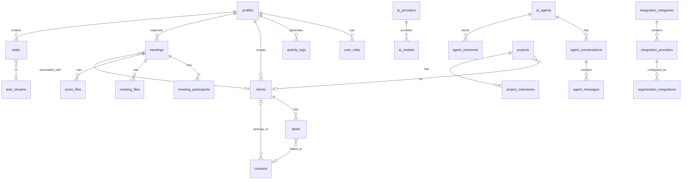

---

## 15. Development Workflow

Standard workflow for adding new features to the framework.

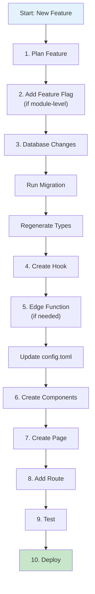

### Checklist for New Features

1. **Plan Feature**
   - Define requirements
   - Identify database changes
   - Determine if edge functions needed

2. **Feature Flag** (if module-level)
   - Add to `app_config` table
   - Update `useFeatureFlags` hook
   - Wrap route with `ModuleRoute`

3. **Database Changes**
   - Create migration SQL
   - Add RLS policies
   - Test policies manually

4. **Create Hook**
   - Follow existing pattern
   - Use React Query
   - Handle loading/error states

5. **Edge Function** (if needed)
   - Create function folder
   - Add to `config.toml`
   - Set `verify_jwt` appropriately
   - Add to deployment script

6. **Create Components**
   - Use shadcn/ui components
   - Follow component hierarchy
   - Keep components focused

7. **Create Page**
   - Use appropriate layout
   - Handle loading/empty states
   - Add error boundaries

8. **Add Route**
   - Add to `App.tsx`
   - Wrap with appropriate guards
   - Add to sidebar navigation

9. **Test**
   - Test happy path
   - Test error cases
   - Test RLS policies
   - Test with different user roles

10. **Deploy**
    - Deploy edge functions
    - Verify in production
    - Monitor logs

---

## 16. Deployment Architecture

The framework deploys across multiple services.

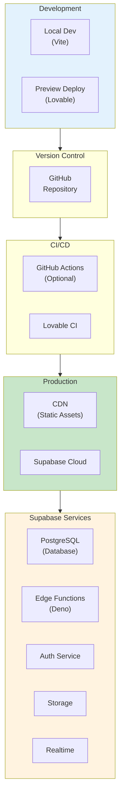

### Environment Configuration

| Environment | Frontend | Backend | Secrets |
|-------------|----------|---------|---------|
| Development | localhost:5173 | Supabase Cloud | .env.local |
| Preview | Lovable Preview | Supabase Cloud | Lovable Secrets |
| Production | CDN | Supabase Cloud | Supabase Secrets |

### Required Secrets

See [SECRETS_MANAGEMENT.md](./SECRETS_MANAGEMENT.md) for complete list:

| Secret | Required For |
|--------|--------------|
| `OPENAI_API_KEY` | AI features |
| `SENDGRID_API_KEY` | Email notifications |
| `ZOOM_CLIENT_ID/SECRET` | Zoom integration |
| `GOOGLE_CLIENT_ID/SECRET` | Google Drive integration |

---

## 17. Scalability Considerations

Architecture evolution from current state to larger deployments.

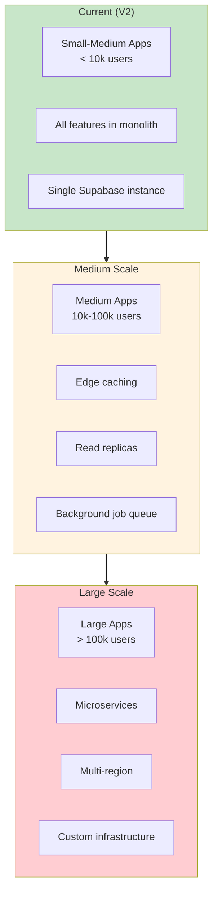

### Current Optimizations

| Area | Implementation |
|------|----------------|
| Caching | React Query with localStorage persistence |
| Query Performance | Database indexes, RLS optimization |
| Edge Functions | Shared utilities, efficient imports |
| Frontend | Code splitting, lazy loading |

### Future Considerations

| Scale | Recommendations |
|-------|-----------------|
| 10k+ users | Add Redis caching, connection pooling |
| 50k+ users | Read replicas, CDN for API responses |
| 100k+ users | Consider Supabase Enterprise, custom infra |

---

## 18. Theming System

The framework uses CSS variables with Tailwind for consistent theming.

```mermaid
graph LR
    subgraph Config2["Configuration"]
        CSS["index.css<br/>(CSS Variables)"]
        TW["tailwind.config.ts"]
    end
    
    subgraph Vars["CSS Variables"]
        Colors["--background<br/>--foreground<br/>--primary<br/>--secondary<br/>--accent<br/>--muted"]
        Radius["--radius"]
        Shadows["Custom shadows"]
    end
    
    subgraph Modes["Color Modes"]
        Light[":root { }"]
        Dark[".dark { }"]
    end
    
    subgraph Usage["Usage"]
        TailwindClasses["bg-background<br/>text-foreground<br/>text-primary"]
    end
    
    Config2 --> Vars
    Vars --> Modes
    Modes --> Usage
    
    style Config2 fill:#e3f2fd
    style Modes fill:#fff3e0
    style Usage fill:#c8e6c9
```

### CSS Variable Structure

```css
:root {
  /* Base colors */
  --background: 0 0% 100%;
  --foreground: 222.2 84% 4.9%;
  
  /* Primary palette */
  --primary: 222.2 47.4% 11.2%;
  --primary-foreground: 210 40% 98%;
  
  /* Secondary palette */
  --secondary: 210 40% 96.1%;
  --secondary-foreground: 222.2 47.4% 11.2%;
  
  /* Accent colors */
  --accent: 210 40% 96.1%;
  --accent-foreground: 222.2 47.4% 11.2%;
  
  /* Muted colors */
  --muted: 210 40% 96.1%;
  --muted-foreground: 215.4 16.3% 46.9%;
  
  /* Semantic colors */
  --destructive: 0 84.2% 60.2%;
  --border: 214.3 31.8% 91.4%;
  --ring: 222.2 84% 4.9%;
  
  /* Radius */
  --radius: 0.5rem;
}

.dark {
  --background: 222.2 84% 4.9%;
  --foreground: 210 40% 98%;
  /* ... dark mode overrides */
}
```

---

## 19. Framework Tiers

Features organized by implementation priority.

```mermaid
graph TB
    subgraph T1["Tier 1: Must-Have Base"]
        Auth4["Authentication<br/>(Google OAuth + Email)"]
        Guards2["Route Guards<br/>(Protected, Admin, Module)"]
        UIComp["UI Component Library<br/>(49 shadcn/ui)"]
        Forms2["Form Handling<br/>(React Hook Form + Zod)"]
        Security2["Security<br/>(RLS, Sanitization)"]
        Toast2["Toast Notifications"]
        Error["Error Boundaries"]
        Flags["Feature Flags"]
    end
    
    subgraph T2["Tier 2: Commonly Needed"]
        Layouts2["Dashboard Layouts<br/>(Main + Admin)"]
        Caching2["React Query Caching"]
        Export["Data Export<br/>(PDF, CSV)"]
        Common2["Common Components<br/>(Empty, Loading)"]
        Branding2["Branding Context"]
        Activity["Activity Logging"]
    end
    
    subgraph T3["Tier 3: Optional Add-ons"]
        EmailInt["Email Integration<br/>(SendGrid)"]
        IntHub2["Integration Hub"]
        AIChat3["AI Chat + Agents"]
        Search2["Semantic Search"]
        UserKnow2["User Knowledge Base"]
        Zoom2["Zoom Integration"]
    end
    
    T1 --> T2
    T2 --> T3
    
    style T1 fill:#c8e6c9
    style T2 fill:#fff3e0
    style T3 fill:#e3f2fd
```

### Tier Details

| Tier | When to Include | Effort |
|------|-----------------|--------|
| Must-Have | Always | Included by default |
| Commonly Needed | Most projects | 1-2 hours setup |
| Optional | As needed | 2-8 hours per feature |

---

## 20. Key Design Patterns

Patterns used throughout the framework.

### Cache-Aside Pattern

```typescript
// React Query with cache
const { data, isLoading } = useQuery({
  queryKey: ['clients', filters],
  queryFn: () => fetchClients(filters),
  staleTime: 5 * 60 * 1000, // 5 minutes
});

// Invalidate on mutation
const mutation = useMutation({
  mutationFn: createClient,
  onSuccess: () => {
    queryClient.invalidateQueries({ queryKey: ['clients'] });
  },
});
```

### Protected Route Pattern

```typescript
// Nested protection with feature flags
<Route path="/meetings" element={
  <ProtectedRoute>
    <ModuleRoute featureFlag="enableMeetings">
      <DashboardLayout>
        <Meetings />
      </DashboardLayout>
    </ModuleRoute>
  </ProtectedRoute>
} />
```

### Dynamic Form Field Pattern

```typescript
// Database-driven form fields
interface FormField {
  field_key: string;
  field_type: 'text' | 'password' | 'select' | 'checkbox';
  label: string;
  is_required: boolean;
  validation_regex?: string;
}

const DynamicFormField = ({ field, value, onChange }) => {
  switch (field.field_type) {
    case 'select':
      return <Select options={field.select_options} />;
    case 'checkbox':
      return <Checkbox checked={value} />;
    default:
      return <Input type={field.field_type} />;
  }
};
```

### Multi-Provider AI Routing Pattern

```typescript
// Dynamic AI provider selection
const routeToProvider = async (
  prompt: string,
  config: ProviderConfig
): Promise<AIResponse> => {
  const provider = await getProvider(config.provider);
  
  switch (provider.slug) {
    case 'openai':
      return callOpenAI(prompt, config);
    case 'anthropic':
      return callAnthropic(prompt, config);
    case 'gemini':
      return callGemini(prompt, config);
    default:
      throw new Error(`Unknown provider: ${provider.slug}`);
  }
};
```

### OAuth Token Refresh Pattern

```typescript
// Automatic token refresh
const getValidToken = async (integrationId: string): Promise<string> => {
  const integration = await getIntegration(integrationId);
  
  if (isTokenExpired(integration.oauth_tokens)) {
    const newTokens = await supabase.functions.invoke('oauth-refresh-token', {
      body: { integration_id: integrationId }
    });
    return newTokens.access_token;
  }
  
  return integration.oauth_tokens.access_token;
};
```

### Edge Function Wrapper Pattern

```typescript
// Consistent edge function structure
import { serve } from "https://deno.land/std@0.168.0/http/server.ts";
import { corsHeaders } from "../cors.ts";
import { createClient } from "https://esm.sh/@supabase/supabase-js@2";

serve(async (req) => {
  // Handle CORS preflight
  if (req.method === "OPTIONS") {
    return new Response(null, { headers: corsHeaders });
  }

  try {
    // Create authenticated client
    const supabase = createClient(
      Deno.env.get("SUPABASE_URL")!,
      Deno.env.get("SUPABASE_SERVICE_ROLE_KEY")!
    );

    // Parse request
    const { data, error } = await processRequest(req, supabase);

    if (error) throw error;

    return new Response(JSON.stringify(data), {
      headers: { ...corsHeaders, "Content-Type": "application/json" },
    });
  } catch (error) {
    return new Response(JSON.stringify({ error: error.message }), {
      status: 400,
      headers: { ...corsHeaders, "Content-Type": "application/json" },
    });
  }
});
```

---

## 21. Summary & References

### Architecture Summary

The SJ Dashboard Framework V2 provides:

- **29 pages** covering landing, dashboard, business features, AI, and admin functionality
- **24 custom hooks** for data management and feature logic
- **31 edge functions** for server-side processing
- **26 database tables** with comprehensive RLS policies
- **49 UI components** from shadcn/ui
- **3 storage buckets** for file management
- **Multi-provider AI** with OpenAI, Anthropic, and Gemini support
- **Integration Hub** for dynamic third-party connections

### Quick Reference

| Need | Location |
|------|----------|
| Add a page | `src/pages/`, update `App.tsx` |
| Add a hook | `src/hooks/` |
| Add a component | `src/components/[category]/` |
| Add an edge function | `supabase/functions/`, update `config.toml` |
| Add a database table | Create migration, update RLS |
| Add a feature flag | `app_config` table, `useFeatureFlags` |
| Add an integration | Integration Hub tables |

### Related Documentation

| Document | Purpose |
|----------|---------|
| [QUICKSTART.md](./QUICKSTART.md) | Getting started guide |
| [DEPLOYMENT.md](./DEPLOYMENT.md) | Deployment instructions |
| [ADMIN-GUIDE.md](./ADMIN-GUIDE.md) | Admin panel usage |
| [SECRETS_MANAGEMENT.md](./SECRETS_MANAGEMENT.md) | Managing secrets |
| [INTEGRATION_USER_GUIDE.md](./INTEGRATION_USER_GUIDE.md) | Integration setup |
| [INTEGRATION_API_REFERENCE.md](./INTEGRATION_API_REFERENCE.md) | API documentation |

---

*Document Version: 2.0 | Last Updated: January 2026*
